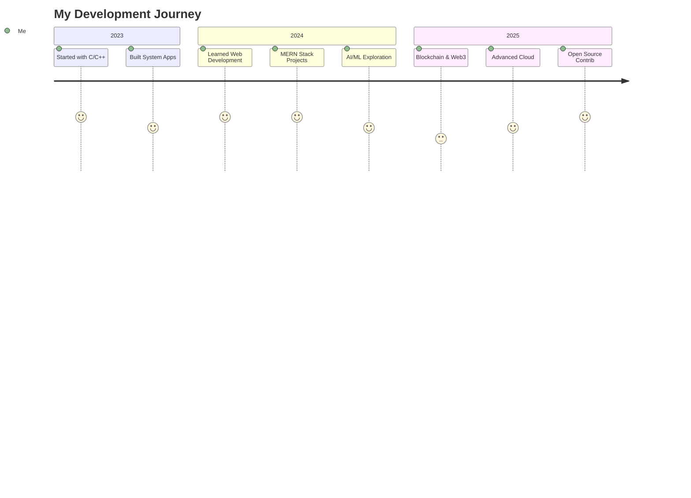
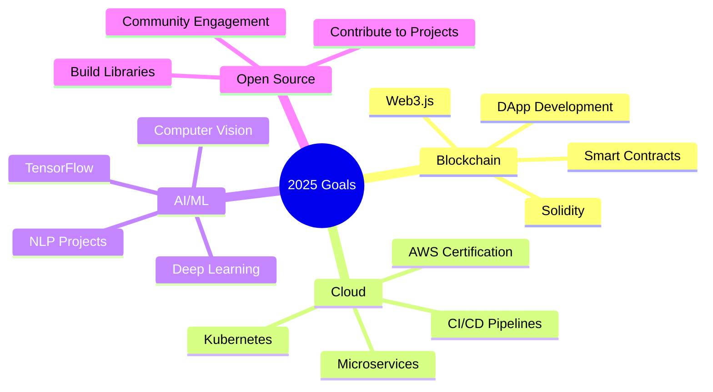

<div align="center">

# 👋 Hi, I'm **Ganeshpriyan M**


### 🎓 B.E. Computer Science & Engineering | Anna University, MIT Campus

<p>
💡 <i>Building intelligent systems and scalable applications that bridge technology with real-world impact</i>
</p>

[](https://www.linkedin.com/in/ganeshpriyan-mohan-680814323)
[](https://templechatbot.streamlit.app/)
[](mailto:your.email@example.com)


</div>

---

## 🚀 About Me

```javascript
const ganeshpriyan = {
    location: "Chennai, Tamil Nadu 🇮🇳",
    education: "Anna University, MIT Campus",
    graduationYear: 2027,
    currentFocus: ["Full-Stack Development", "AI/ML", "Blockchain"],
    passions: ["Building Scalable Systems", "Solving Complex Problems", "Open Source"],
    motto: "Code. Create. Innovate. Repeat. 🔁"
};
```

<table>
<tr>
<td width="50%">

### 💻 What I Do

- 🌐 Build **scalable web applications** with MERN Stack
- 🔐 Develop **secure system-level** apps in C/C++
- 🤖 Create **AI-powered solutions** using Python & ML
- 💾 Design **database-driven systems** with SQL & NoSQL
- 📊 Explore **Data Science** for predictive modeling

</td>
<td width="50%">

### 🎯 Currently Exploring

- 🔗 **Blockchain Development**  
  Smart Contracts, DApps, Web3
  
- 📊 **Data Science & Analytics**  
  Pandas, Scikit-learn, Visualization
  
- ☁️ **Cloud Architecture**  
  Azure, AWS, Microservices

</td>
</tr>
</table>

---

## 🛠️ Tech Arsenal

<div align="center">

### 💻 Languages


### 🎨 Frontend


### ⚙️ Backend


### 🗄️ Databases


### 🤖 AI/ML & Data Science


### 🛠️ Tools & DevOps


</div>

---

## 🎯 Featured Projects

<div align="center">

<table>
<tr>
<td width="50%">

### 🏏 Cricket Fantasy League
**MERN Stack**

A full-stack fantasy cricket platform with:
- 👥 Dynamic team creation & player selection
- 📊 Real-time performance tracking
- 🏆 Live leaderboard system
- 💾 MongoDB data persistence

**Tech**: React.js • Node.js • Express.js • MongoDB

[](https://github.com)

</td>
<td width="50%">

### 🤖 Temple Chatbot
**AI-Powered Assistant**

Intelligent chatbot with:
- 💬 Natural language processing
- 🌐 Multilingual support
- 📚 Temple information database
- ⚡ Real-time responses

**Tech**: Python • Streamlit • NLP • AI

[](https://templechatbot.streamlit.app/)

</td>
</tr>

<tr>
<td width="50%">

### 🏦 Bank Management System
**C++ Application**

Secure banking system featuring:
- 🔐 User authentication & security
- 💰 Balance tracking & transfers
- 📝 Transaction history
- 🗂️ File-based data storage

**Tech**: C++ • File I/O • OOP

[](https://github.com)

</td>
<td width="50%">

### 👨‍💼 Employee CRUD System
**Full-Stack Web App**

Complete employee management with:
- ✏️ Create, Read, Update, Delete operations
- 🗄️ Oracle SQL backend integration
- 🎨 Responsive web interface
- 🔒 Secure data handling

**Tech**: HTML • CSS • JavaScript • Oracle SQL

[](https://github.com)

</td>
</tr>

<tr>
<td width="50%">

### 🔐 Cipher Text Encryption
**C Programming**

Classical cryptography system:
- 🔑 Key-based encryption/decryption
- 🛡️ Secure text transformation
- ⚡ Fast processing algorithms
- 📖 Educational implementation

**Tech**: C • Cryptography • Algorithms

[](https://github.com)

</td>
<td width="50%">

### 🧳 Travel Planner
**Java Application**

Comprehensive trip planning tool:
- 🗺️ Destination management
- 🚗 Transportation options
- 🏨 Accommodation tracking
- 💵 Budget calculation

**Tech**: Java • Swing/JavaFX • OOP

[](https://github.com)

</td>
</tr>
</table>

</div>

---

## 📊 GitHub Statistics

<div align="center">


</div>

---

## 🏆 GitHub Trophies

<div align="center">

[](https://github.com/ryo-ma/github-profile-trophy)

</div>

---

## 💡 Tech Journey



---

## 🎓 Skills Matrix

<div align="center">

| Category | Technologies | Proficiency |
|----------|--------------|-------------|
| **Frontend** | React, HTML/CSS, JavaScript | ████████░░ 80% |
| **Backend** | Node.js, Express, Spring Boot | ███████░░░ 75% |
| **Databases** | MongoDB, Oracle SQL, MySQL | ████████░░ 80% |
| **Languages** | C/C++, Java, JavaScript, Python | █████████░ 85% |
| **AI/ML** | Scikit-learn, Pandas, NLP | ██████░░░░ 65% |
| **DevOps** | Git, Cloud (Azure), Docker | ██████░░░░ 60% |

</div>

---

## 🌱 Learning Roadmap 2025

<div align="center">



</div>

---

## 📈 Activity Graph

<div align="center">

[](https://github.com/ashutosh00710/github-readme-activity-graph)

</div>

---

## 🎯 2025 Goals

<table>
<tr>
<td width="33%" align="center">

### 🚀 Technical

- ✅ Master Blockchain Development
- ✅ Build 5 Full-Stack Projects
- ✅ Contribute to 10+ Open Source
- ✅ Learn Cloud Architecture

</td>
<td width="33%" align="center">

### 🏆 Achievements

- 🎯 Complete 3 Certifications
- 🏅 Win a Hackathon
- 📝 Write 12 Tech Blogs
- 🎤 Give 2 Tech Talks

</td>
<td width="33%" align="center">

### 🌐 Community

- 👥 Mentor 10+ Developers
- 🤝 Collaborate on Projects
- 📚 Create Learning Resources
- 💬 Active in Tech Forums

</td>
</tr>
</table>

---

## 📫 Let's Connect!

<div align="center">

### 💬 Feel free to reach out for collaborations or just a friendly chat!

[](https://www.linkedin.com/in/ganeshpriyan-mohan-680814323)
[](mailto:your.email@example.com)
[](https://twitter.com)
[](https://discord.com)

<br/>

### ⭐ If you find my projects interesting, don't forget to star them!


</div>

---

<div align="center">

### 🎨 "Code is like humor. When you have to explain it, it's bad." - Cory House

**Made with 💙 and lots of ☕ by Ganeshpriyan M**


</div>
